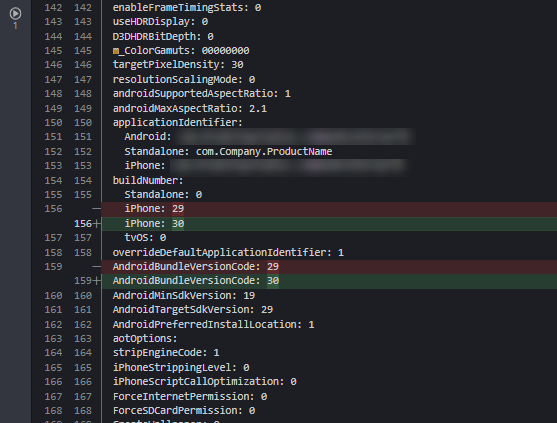
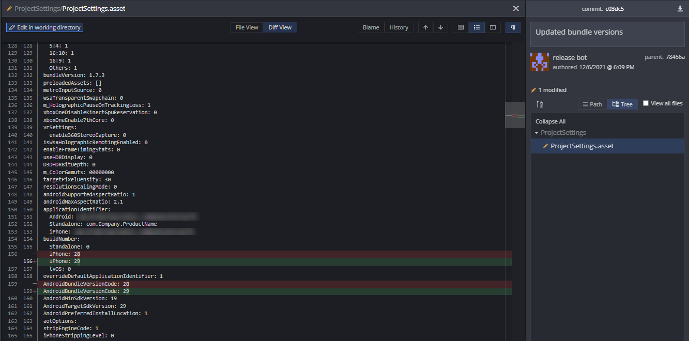

# Unity Mobile Build Number Bumper
Github action that bumps the **AndroidBundleVersionCode** &amp; **iOS Build Number** by 1 in the Unity ProjectSettings.asset file.

## Outputs
* `android-build-number-before` - The build number for Android before the bump.
* `android-build-number-after` - The build number for Android after the bump.
* `ios-build-number-before` - The build number for iOS before the bump.
* `ios-build-number-after` - The build number for iOS after the bump.

## Example Usage

```yaml
name: Bump Number

on: workflow_dispatch

jobs:
  bump-number-job:
    runs-on: ubuntu-latest
    name: A job to test unity-mobile-build-number-bumper
    steps:
      - name: "Checkout"
        uses: actions/checkout@v2
        with:
          fetch-depth: 0
      - name: Unity Mobile Build Bumper
        id: unity-mobile-build-bumper
        uses: Breakstep-Studios/unity-mobile-build-number-bumper@composite
      - name: "Add, Commit And Push Prepared Files"
        run: |
          git config --global user.email "releasebot@users.noreply.github.com"
          git config --local user.name "release bot"
          git add -A
          git commit -m "Updated bundle versions"
          git push
      - name: "Output numbers"
        run: |
          echo iOS build number: ${{ steps.unity-mobile-build-bumper.outputs.ios-build-number-before }} -> ${{ steps.unity-mobile-build-bumper.outputs.ios-build-number-after }}
          echo Android build number: ${{ steps.unity-mobile-build-bumper.outputs.android-build-number-before }} -> ${{ steps.unity-mobile-build-bumper.outputs.android-build-number-after }}
```
## Example Output

